# Overview scope of the program

## The Data Science ecosystem

Data Science is the art of using data to understand, predict, and solve real-world problems, making it an invaluable tool across all fields for informed decision-making and innovative solutions.

- **Domain and Fundamental knowledge:** Understanding and expertise in specific subject areas (domains) along with foundational knowledge necessary to comprehend and engage with various disciplines and concepts.
- **Computer Science:** The study of algorithms, data structures, and computational systems for solving problems and processing information using computers.
- **Math & statistics:** The discipline that deals with the analysis, interpretation, and manipulation of numerical data, patterns, and relationships, relying on mathematical principles and methodologies.

## The data jobs/roles ecosystem

Data jobs are becoming increasingly influential in every domain of knowledge due to the widespread adoption of data-driven decision-making. As data-driven approaches offer valuable insights and predictions, professionals with data skills can extract valuable information from data

- **Business Analyst:** Utilizes data to determine project requirements and provides recommendations and reports to stakeholders, focusing on tactical aspects rather than strategic ones.
- **Data Architects and Data Engineers:** Data architects visualize framework requirements, while data engineers build the digital framework to create a solution.
- **Data Analyst:** Analyzes collected data to ensure usefulness and comprehensiveness, interpreting data with strong visualization skills for businesses.
- **Data Scientist:** Combines technical problem-solving skills with natural curiosity to develop ML models and detect patterns and relationships in copious amounts of data.
- **Machine Learning Engineer:** Integrates software engineering with machine modeling abilities, determining the appropriate model and data for ML applications.
- **Business Intelligence Engineer:** Creates unique data visualizations, defining metrics and charts beneficial for business decisions, playing a crucial role in specialized data science models.

## The Software ecosystem

In this course, we prioritize easy-to-learn and widely used software solutions among the thousands of programming languages, frameworks, and distributions available.

``` mermaid
graph TD
    PC{Python\n cloud} -.->|connects| GC["✅ Google \n Collab"];
    G["☁ Google VM"] -->|has| PC;
    YC["💻 Your computer"] -->|has*| AP{Anaconda\n Python};
    YC -->|has*| PL{Python\n local};
    AP -.->|connects| APJN["✅ Jupyter \n notebook"];
    AP -.->|connects| APC["✅ Console:\n Anaconda\n promt"];
    AP -.->|connects| API[IDE:\n Spyder];
    PL -.->|connects| F[IDE:\n VSCode,\n Pycharm];
    PL -.->|connects| YCC["✅ Console:\n cmd,\n powershell"];
    GIT -.->|connects| YCB["✅ Console:\n Git Bash"];
    YC -->|has*| GIT["✅ GIT"];
    GT["☁ GITHUB"] -.->|connects| GIT;
```

### Glossary

- **Google Collab:** A free cloud-based platform that allows to write and execute Python code in interactive notebooks using Google's resources.
- **Anaconda:** A user-friendly Python distribution that bundles essential libraries and tools for data science and machine learning.
- **Python:** A versatile programming language widely used for various tasks, including data analysis, web development, and automation.
- **Jupyter notebook:** An interactive environment that lets users write, execute, and visualize code, making it ideal for data exploration and sharing.
- **IDE:** A software application that provides tools and features to write, edit, and debug code efficiently.
- **GIT:** A version control system that allows to track changes in their code, collaborate with others, and manage code development effectively.
- **Github:** A web-based platform that uses GIT for version control and provides a space to store, share, and collaborate on their code projects.
- **Console:** A text-based interface in an operating system that allows users to interact with the computer through commands, performing tasks such as file navigation, program execution, and system configuration.

## The ML ecosystem

In this course, we focus on explaining easily understandable supervised and unsupervised machine learning models, as they are commonly used and provide a solid foundation for learning the basics of machine learning.

``` mermaid
graph TD
    ML[ML models] -->|Labeled data| SML["✅ Supervised models"];
    ML -->|Unlabeled data| UML["✅ Unsupervised models"];
    ML -->|Time data| TS["Time series"];
    ML -->|Reward| RL["Reinforcement learning"];
    SML -->|Continuous var| MLR[Regression];
    SML -->|Categorical var| MLC[Classification];
    UML --> UMLC[Clustering];
    UML --> UMLDR[Dimensionality reduction];
    MLR --> LR{Linear\n regresion};
    MLR --> LRM{Multilinear\n regresion};
    MLC --> KNN{KNN};
    MLC --> DC{Decision\n trees};
    MLC --> RF{Random\n forest};
    UMLC --> KMNS{K-means};
    UMLDR --> PCA{PCA};
```

