# Git & Github

Visit [the software ecosystem](../../overview/#the-software-ecosystem) to have an overview of the software you are going to use in this course.

## 1. Consoles

<div class="highlighted">
A console is similar to a file explorer, but instead of a visual interface, it's a text-based interface on a computer. It allows you to enter commands for tasks like navigating, copying, and moving files.
</div>

A file explorer offers a graphical interface for navigating files and folders using buttons and icons, while a console provides a text-based interface where commands are typed to interact with the file system. They serve distinct purposes, with a file explorer being visual and user-friendly, and a console offering command-driven control and automation.

### 1.2 Console commands

| Command | Example | Action |
| --- | --- | --- |
| ls | `ls`  {`-a`, `-l`} | List the current directory files |
| cd DIR | `cd "My documents"` | Change directory |
| cd .. | `cd ..` | Back to the upper directory one level |
| clear | `clear` | Clean console |
| history | `history` | Shows latest commands |
| tab | - | Show available options, autocomplete |
| Up Arrow | - | Extract last command |
| ctrl + l | - | Scroll to active line |
| ctrl + r | - | Search in the command history |
| ctrl + c | - | Stop & kill running command |

??? tip "Advanced commands"
    | Command | Example | Action |
    | --- | --- | --- |
    | pwd | `pwd` | Print working directory path |
    | cat FILE | `cat README.md` | Shows the contents of the file |
    | touch FILE | `touch README.md` | Creates an empty file |
    | mkdir FOLDER | `mkdir "My documents"` | Create a new folder on actual directory |
    | mv FILE DIR | `mv notebook.ipynb "My documents"` | Move file to a new directory |
    | cp FILE DIR | `cp notebook.ipynb "My documents"` | Move file to a new directory |
    | rm FILE | `rm notebook.ipynb` | Remove selected file |
    | rm -r FOLDER | `rm -r "My documents"` | Remove a folder and all the files inside |
    | find --name FILE | `find --name README.md"` | Search for a file in the directory and sublevels |

## 2. Git & Github

Think of **Git** like a notebook that **tracks all the changes you make to your writing**, letting you go back and see every draft. **GitHub** is like **a library where you can keep your notebooks**, and others can borrow them, read your writing, make suggestions, and even work on their own versions of the same story.

### 2.1 Git commands

| Command | Example | Action |
| --- | --- | --- |
| **git clone REPO-NAME** | `git clone https://github.com/user/repo.git` | Clone a repository in the local computer |
| **git pull** | `git pull` | Description |
| git status | `git status` | Description |
| git fetch | `git fetch` | Description |
| **git add** | `git add .` ; `git add *` | Description |
| **git commit -m "MESSAGE"** | `git commit -m "update: new section readme"` | Description |
| **git push** | `git push`; `git push origin main` | Description |
| git reset --soft | `git reset --soft` | Keep files but destroy the commits staged |
| git reset --hard | `git reset --hard` | Destroy changes and go to the remote state |

??? tip "Git branching commands"
    | Command | Example | Action |
    | --- | --- | --- |
    | git switch BRANCH | `git switch dev-carlos` | Switch to the selected branch | 
    | git switch -c BRANCH | `git switch -c dev-carlos` | Create new branch and switch to that branch | 
    | git branch | `git branch` (-a- ; -r) | Shows local and remote branches | 
    | git remote prune origin | `git remote prune origin` | Update remote branchs in local memory | 


### 2.2 What is Git

<div class="highlighted">
Imagine Git as a time-traveling tool for your computer files. It keeps a record of every change you make, so if you accidentally mess something up, you can go back in time to fix it. It's like having an "undo" button for all your coding adventures.
</div>


??? example "Example: Clonning, committing, and pushing changes"

    In this example, you'll learn how to clone a repository, create a README.md file, commit changes, and push them to GitHub.

    1. Clone the Repository:
    2. Open your console (Git Bash, Command Prompt, etc.), and navigate to the directory where you want to clone the repository.
    3. Run the following command to clone the repository:
        ```bash
        git clone <repository_url>
        ```
    4. Change into the cloned repository's directory:
        ```bash
        cd <repository_name>
        ```

    5. Create a README.md File by running this command.
        ```bash
        touch README.md
        ```
    6. Commit the Changes by adding the `README.md` file to the staging area:
        ```bash
        git add README.md
        ```
    7. Commit the changes with a meaningful commit message:
        ```bash
        git commit -m "Add README.md"
        ```
    8. Push Changes to Remote Repository:
        ```bash
        git push origin main
        ```

    That's it! You have successfully cloned a repository, created a `README.md` file, committed your changes, and pushed them to the remote repository.


### 2.3 What is Github

<div class="highlighted">
GitHub is like a library for your computer code. It lets you store your code online, so you can access it from anywhere. You can also invite friends to help you work on your code and keep track of all the changes you make.
</div>

GitHub is a platform where people store and colaborate on code for software projects. It's like a digital space where programmers can work together on coding projects.

A repository in GitHub is like a digital folder where you can store and manage your projects, including code, files, and resources. It's a space to colaborate, keep track of changes, and showcase your work. To create a repository you can follow [the official documentation](https://docs.github.com/es/get-started/quickstart/create-a-repo).

``` mermaid
graph TD
    G[Github] --> PP["📷\nDeveloper\nprofile"];
    G --> RP[("⌸ Your\nrepositories")];
    G --> PR[("⌸ Public\nrepositories")];
```



### 2.4 What is a repository

<div class="highlighted">
A repository is like a folder where you store files for a project. It holds your work, tracks changes, and allows others to colaborate on the project. It's like a digital toolbox.
</div>

A repository can be either **local, stored on your computer**, or **remote, stored on a server** like Github. They are linked by using version control systems like Git. Local repositories store your work offline, while remote repositories, often hosted on platforms like GitHub, enable colaboration and backup by syncing changes between local and remote versions.

``` mermaid
graph TD
    G["🅶\nGithub"] --> UR["👩‍💻User profile"];
    UR --> RR[("⧠ Remote\nrepository")];
    RR -->|pull| LG1["⧠\nLocal GIT"];
    LG1 -->|push| RR;
    LG1 -->|pull| WS1["👩‍💻\nLocal computer 1"];
    WS1 -->|commit| LG1;
    WS1 --> LR1[("🖿\nLocal\nrepository")];
    RR -->|pull| LG2["⧠\nLocal GIT"];
    LG2 -->|push| RR;
    LG2 -->|pull| WS2["👨‍💻\nLocal computer 2"];
    WS2 -->|commit| LG2;
    WS2 --> LR2[("🖿\nLocal\nrepository")];
    RR -->|pull| LG3["⧠\nLocal GIT"];
    LG3 -->|push| RR;
    LG3 -->|pull| WS3["👩‍💻\nLocal computer 3"];
    WS3 -->|commit| LG3;
    WS3 --> LR3[("🖿\nLocal\nrepository")]
```



??? example "Example: creating a new repository in Github"

    This example shows how to create a new repository on GitHub.

    1. In the upper-right corner of any page, use the :material-plus-box: drop-down menu, and select New repository.

        

    2. Choose a name for your repository. This name will be part of the repository's URL and should be descriptive.

        

    3. Add an optional description to provide more information about the repository. You can always add it later. Example:

        > A repository exploring Reinforcement Learning methods in Python.

    4. Select the repository's visibility: Public or private.
    5. Choose whether to initialize the repository with a README file. This is recommended, as it provides a place to describe your project.
    6. If needed, you can choose to add a .gitignore file (specifies files/folders that should not be tracked by Git) and a license to your repository.
    7. Click Create repository.

    Congratulations you have created your new repository.


### 2.5 What is a branch

<div class="highlighted">
A branch is like a separate copy of your repository where you can make changes without affecting the main version. It's like having a playground to experiment and work on new features before adding them to the main project.
</div>


??? example "Example: creating and switching branches"

    This example shows a common workflow to create a new branch `dev-new-branch` from the original files of `main` branch.

    1. **Clone repository.** 
        ```sh
        git clone https://github.com/charlstown/ai-applied-education.git
        ```
    2. **Check branch.** By default it shows local branches, you can add the flag `-r` to show only remote branches or `-a` to show all.
        ```sh
        git branch -a
        ```
        ```output
        remotes/origin/dev-marta
        remotes/origin/dev-juan
        * main
        ```
    3. **Check dev-marta branch.**
        ```sh
        git switch dev-marta
        git pull
        ```
        ```output title="output"
        Switched to branch 'dev-marta'
        Your branch is behind 'origin/main' by 23 commits, and can be fast-forwarded.
        (use "git pull" to update your local branch)

        Already up to date.
        ```
    4. **New branch from main.** Change to main branch, then create a new branch with the files from main.
        ```sh
        git switch main
        git pull
        git switch -c dev-new-branch
        ```
    5. **Push new branch.** Push the new branch from local repository to remote repository.
        ```
        git push –set-upstream origin dev-new-branch
        ```

    Now you can start working on your branch without iterfering the `main` branch.


## 3. Test your skills

### 3.1 Create a profile repository

The profile README is a repository where you can share information about yourself with the community on GitHub.com by creating a profile README. GitHub shows your profile README at the top of your profile page. Check the oficial documentation of [Github profile README](https://docs.github.com/en/account-and-profile/setting-up-and-managing-your-github-profile/customizing-your-profile/managing-your-profile-readme).

<div class="steps" markdown>
- In the upper-right corner of any page, use the :material-plus-box: drop-down menu, and select New repository.

    

- Under "Repository name", type a repository name that matches your GitHub username. For example, if your username is "octocat", the repository name must be "octocat".
- Optionally, in the "Description" field, type a description of your repository. For example, "My personal repository."
- Select Public.
- Select Initialize this repository with a README.
- Click Create repository.
- Above the right sidebar, click Edit README.
</div>

??? tip "Add your repo stats to your README"
    You can add this line of markdown in your README file, to add stats about your work in Github.
    ```markdown
    [](https://github.com/anuraghazra/github-readme-stats)
    ```

You can copy this structure to create your README easily.
```markdown
## Hello 👋

Welcome to my Github account! I'm YOUR NAME a ... enthusiast.
In this account, you'll find projects, and resources about ...
I hope you enjoy my content and find it useful.

</br>

### About me

- :computer: I’m currently studying ...
- :microscope: I’m currently learning `AI applied`.
- :v: I’m looking to colaborate on coding for ...


### My favorite repos

- :desktop_computer: **[My repo](#):**.
- :desktop_computer: **[My repo](#):**.
- :desktop_computer: **[My repo](#):**.


### Thank you!

If you have any questions, or comments, please get in touch.

Happy coding! :vulcan_salute:

-- @username
```

Congratulations! You've successfully created your profile README. 


### 3.2 Apply to the program as new student

To request the application for this program you need to know how to fork (copy) the official course repository, modify the files by adding your name and email, and making a pull request to the original repository to add your student data.

#### Fork the course repository

<div class="steps" markdown>
- Go to the [ai-applied-repository](https://github.com/charlstown/ai-applied-education), that contains the files of this course.
- Fork the repository by pressing the fork button on the top right corner.
    
- Add you user as owner of the new copy of the repository, and make sure you only copy the main branch.
    
</div>

#### Clone the repository in your local computer

<div class="steps" markdown>
- Open your prefered console, git bash or anaconda and go to the directory where you want to clone the project.
    ```bash
    cd "E:\My PC\00_WIP"
    ```
- Make sure you are in the correct directory by running the `pwd` command and check if the folder is empty `ls`.
    ```bash
    pwd
    ls
    ```
- Copy the link of the repository by clicking the code button and the :octicons-copy-16: `copy` icon
    
- Now clone the repository locally by running the following.
    ```bash
    git clone THE-COPIED-REPOSITORY-LINK
    ```
</div>

#### Add yourself to the students list

To add your yourself to the student list you need to locate the file `ai-applied-education/docs/program/students.md`, and add your name to the markdown table.

<div class="steps" markdown>

- Open Anacoda Promt console, and Navigate to the file `students.md`, you can do this by running the following command.
    ```bash
    cd <route-to-your-repository>
    ```
- Start Jupyter Lab in this path.
    ```
    jupyter lab
    ```
- Navigate on the left File Browser to the path `ai-applied-education/docs/program` and open the file `students.md`.
- Add your name to the markdown table **under the example**. (Make sure you copy the same structure)
    ```markdown
    | Name | Email | Github |
    | --- | --- | --- |
    | name | email | github-link |
    | María Jimeno | mjimeno@email.com | https://github.com/mjimeno |
    ```
- Save and close the file.
</div>


#### Commit & Push to remote repository

<div class="steps" markdown>
- Open the git bash console again and navigate to the root path of the repository.
    ```bash
    cd "E:\My PC\00_WIP\AiAppliedEducation"
    ```

- Add the changes by `git add` command.
    ```bash
    git add .
    ```
- Commit the changes to local git by `git commit` command. Make sure you add your name to the command.
    ```
    git commit -m "update: María student added"
    ```
- Push changes to remote repository.
    ```bash
    git push
    ```
- Make sure you pushed your files successfully by visiting your forked github repository in the browser
</div>


#### Pull request to the official repository

- Go to commits ahead message and click the link.
    
- Click the `Create pull request` button to make the pull request to the original repository.
    
- Add a descriptive comment explaining your provided feature somthing like
    ```markdown
    Application of the student "María Jimeno" to the `students.md` file.
    ```
- Send the pull request by clicking the `Merge pull request` button.
    

Congratulations you have applied to the program. You will see your name and email at the [Students site](https://charlstown.github.io/ai-applied-education/program/students/) when the owner of the repository to accept your pull request.
