# Git, Github and Notebooks


## 1. Consoles

<div class="highlighted">
A console is similar to a file explorer, but instead of a visual interface, it's a text-based interface on a computer. It allows you to enter commands for tasks like navigating, copying, and moving files.
</div>

A file explorer offers a graphical interface for navigating files and folders using buttons and icons, while a console provides a text-based interface where commands are typed to interact with the file system. They serve distinct purposes, with a file explorer being visual and user-friendly, and a console offering command-driven control and automation.

### 1.2 Console commands

| Command | Example | Action |
| --- | --- | --- |
| ls | `ls`  {`-a`, `-l`} | List the current directory files |
| cd "DIR" | `cd "My documents"` | Change directory |
| cd .. | `cd ..` | Back to the upper directory one level |
| tab | - | Show available options, autocomplete |
| Up Arrow | - | Extract last command |
| ctrl + r | - | Search in the command history |


## 2. Git & Github

Think of **Git** like a notebook that **tracks all the changes you make to your writing**, letting you go back and see every draft. **GitHub** is like **a library where you can keep your notebooks**, and others can borrow them, read your writing, make suggestions, and even work on their own versions of the same story.

### 2.1 What is Git

<div class="highlighted">
Imagine Git as a time-traveling tool for your computer files. It keeps a record of every change you make, so if you accidentally mess something up, you can go back in time to fix it. It's like having an "undo" button for all your coding adventures.
</div>


### 2.2 What is Github

<div class="highlighted">
GitHub is like a library for your computer code. It lets you store your code online, so you can access it from anywhere. You can also invite friends to help you work on your code and keep track of all the changes you make.
</div>

GitHub is a platform where people store and collaborate on code for software projects. It's like a digital space where programmers can work together on coding projects.

A repository in GitHub is like a digital folder where you can store and manage your projects, including code, files, and resources. It's a space to colaborate, keep track of changes, and showcase your work. To create a repository you can follow [the official documentation](https://docs.github.com/es/get-started/quickstart/create-a-repo).

``` mermaid
graph TD
    G[Github] --> PP["📷\nDeveloper\nprofile"];
    G --> RP[("⌸ Your\nrepositories")];
    G --> PR[("⌸ Public\nrepositories")];
```



### 2.3 What is a repository

<div class="highlighted">
A repository is like a folder where you store files for a project. It holds your work, tracks changes, and allows others to collaborate on the project. It's like a digital toolbox.
</div>

A repository can be either **local, stored on your computer**, or **remote, stored on a server** like Github. They are linked by using version control systems like Git. Local repositories store your work offline, while remote repositories, often hosted on platforms like GitHub, enable collaboration and backup by syncing changes between local and remote versions.

``` mermaid
graph TD
    G["🅶\nGithub"] --> UR["👩‍💻User profile"];
    UR --> RR[("⧠ Remote\nrepository")];
    RR -->|pull| LG1["⧠\nLocal GIT"];
    LG1 -->|push| RR;
    LG1 -->|pull| WS1["👩‍💻\nLocal computer 1"];
    WS1 -->|commit| LG1;
    WS1 --> LR1[("🖿\nLocal\nrepository")];
    RR -->|pull| LG2["⧠\nLocal GIT"];
    LG2 -->|push| RR;
    LG2 -->|pull| WS2["👨‍💻\nLocal computer 2"];
    WS2 -->|commit| LG2;
    WS2 --> LR2[("🖿\nLocal\nrepository")];
    RR -->|pull| LG3["⧠\nLocal GIT"];
    LG3 -->|push| RR;
    LG3 -->|pull| WS3["👩‍💻\nLocal computer 3"];
    WS3 -->|commit| LG3;
    WS3 --> LR3[("🖿\nLocal\nrepository")]
```



### 2.4 What is a branch

<div class="highlighted">
A branch is like a separate copy of your repository where you can make changes without affecting the main version. It's like having a playground to experiment and work on new features before adding them to the main project.
</div>


#### Example

<div class="steps" markdown>
- **Clone repository.** 
    ```sh
    git clone https://github.com/charlstown/ai-applied-education.git
    ```
- **Check branch.** By default it shows local branches, you can add the flag `-r` to show only remote branches or `-a` to show all.
    ```sh
    git branch -a
    ```
    ```output
    remotes/origin/dev-marta
    remotes/origin/dev-juan
    * main
    ```
- **check dev-marta branch.**
    ```
    git checkout dev-marta
    git pull
    ```
</div>


### 2.5 Git commands

| Command | Example | Action |
| --- | --- | --- |
| **git clone REPO-NAME** | `git clone https://github.com/user/repo.git` | Clone a repository in the local computer |
| **git pull** | `git pull` | Description |
| git status | `git status` | Description |
| git fetch | `git fetch` | Description |
| **git add** | `git add .` ; `git add *` | Description |
| **git commit -m "MESSAGE"** | `git commit -m "update: new section readme"` | Description |
| **git push** | `git push`; `git push origin main` | Description |
| git reset --soft | `git reset --soft` | Keep files but destroy the commits staged |
| git reset --hard | `git reset --hard` | Destroy changes and go to the remote state |

??? tip "Git branching commands"
    | Command | Example | Action |
    | --- | --- | --- |
    | git checkout BRANCH | `git checkout dev-carlos` | Switch to the selected branch | 
    | git checkout -b BRANCH | `git checkout -b dev-carlos` | Create new branch and switch to that branch | 
    | git branch | `git branch` (-a- ; -r) | Shows local and remote branches | 
    | git remote prune origin | `git remote prune origin` | Update remote branchs in local memory | 


## 3. Notebooks

Work in progress.

### 3.1 Google Collab

Work in progress.


### 3.2 Jupyter notebooks

Work in progress.


## 4. Test your skills

### 4.1 Create a profile README repository

The profile README is a repository where you can share information about yourself with the community on GitHub.com by creating a profile README. GitHub shows your profile README at the top of your profile page. Check the oficial documentation of [Github profile README](https://docs.github.com/en/account-and-profile/setting-up-and-managing-your-github-profile/customizing-your-profile/managing-your-profile-readme).

<div class="steps" markdown>
- In the upper-right corner of any page, use the :material-plus-box: drop-down menu, and select New repository.

    

- Under "Repository name", type a repository name that matches your GitHub username. For example, if your username is "octocat", the repository name must be "octocat".
- Optionally, in the "Description" field, type a description of your repository. For example, "My personal repository."
- Select Public.
- Select Initialize this repository with a README.
- Click Create repository.
- Above the right sidebar, click Edit README.
</div>

??? tip "Add your repo stats to your README"
    You can add this line of markdown in your README file, to add stats about your work in Github.
    ```markdown
    [](https://github.com/anuraghazra/github-readme-stats)
    ```

You can copy this structure to create your README easily.
```markdown
## Hello 👋

Welcome to my Github account! I'm YOUR NAME a ... enthusiast.
In this account, you'll find projects, and resources about ...
I hope you enjoy my content and find it useful.

</br>

### About me

- :computer: I’m currently studying ...
- :microscope: I’m currently learning `AI applied`.
- :v: I’m looking to colaborate on coding for ...


### My favorite repos

- :desktop_computer: **[My repo](#):**.
- :desktop_computer: **[My repo](#):**.
- :desktop_computer: **[My repo](#):**.


### Thank you!

If you have any questions, or comments, please get in touch.

Happy coding! :vulcan_salute:

-- @username
```

Congratulations! You've successfully created your profile README. 


### 4.2 Clone a repository

Work in progress.


### 4.3 Commit & Push

Work in progress.


### 4.4 Fork a repository

Work in progress.


### 4.5 Pull request

Work in progress.