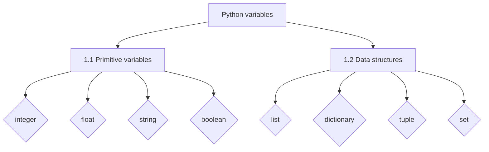

# Introduction to Python

## 1. Basic Python



### 1.1 Variable types

Variable types in Python represent simple, fundamental data types directly supported by the programming language, providing the building blocks for more complex data structures and operations.

| Variable | Declaration | Example |
| --- | --- | --- |
| Integer | *int* | 128; 1 |
| Float | *float* | 1.5; 14. |
| String | *str* | "This is a string."; "126"; ",.$" |
| Boolean | *bool* | True; False |

#### Integer

Example of Integer Variables:

- a = 1
- b = -200
- c = 30000

```py
a = 1
b = -200
c = 399999

print(a)
print(b)
print(c)
```
    <div class="output" markdown>
    1  
    -200  
    399999  
    </div>

#### Float

Example of Float Variables:

- a = 1.
- b = -3.5
- c = 548.36

```py
a = 1.
b = -3.5
c = 548.36

print(a)
print(b)
print(c)
```
    <div class="output" markdown>
    1.0  
    -3.5  
    548.36   
    </div>

#### String

Example of String Variables:

- a = "The Witcher."
- b = "12/09/2023"
- c = "56.1"

```py
a = "The Witcher."
b = "12/09/2023"
c = "56.1"
d = ""

print(a)
print(b)
print(c)
print(d)
```
<div class="output" markdown>
The Witcher.  
12/09/2023  
56.1  
    
</div>


#### Boolean

Example of Boolean Variables:

- a = True
- b = False

```py
a = True
b = False

print(a)
print(b)
```
<div class="output" markdown>
True  
False   
</div>

### 1.2 Data structures

Python data structures are essentially containers for different kinds of data.

| Variable | Declaration | Example |
| --- | --- | --- |
| List | *list* | [1, "Hi", "23", True] |
| Dictionary | *dict* | {"element_a": 3, "other": False} |
| Tuple | *tuple* | (1, "hi", True) |
| Set | *set* | {"a", 4, True, 9} |

??? example "Example of a combined data structure in real life"
    ```py
    song = {
            "title": "Bohemian Rhapsody",
            "artist": "Queen",
            "album": {
                "name": "A Night at the Opera",
                "release_year": 1975,
                "tracks": 12
            },
            "duration": "6:07",
            "genre": ["Rock", "Progressive Rock"],
            "ratings": {
                "five_stars": 3000,
                "four_stars": 2000,
                "three_stars": 500,
                "two_stars": 100,
                "one_star": 50
            },
            "is_explicit": False,
            "featured_artists": ["Freddie Mercury", "Brian May", "Roger Taylor", "John Deacon"]
    }
    ```

#### List

A **list** in Python is a collection of **ordered elements** that can contain different data types and be modified, 
allowing you to store and manage multiple values in a single variable.

??? info "More about lists"
    Lists are mutable, allowing you to modify, add, or remove elements after their creation. Lists are ordered, meaning the elements are stored in a specific sequence, and you can access elements using their index.

Example of List Variables:

- a = [1, 5.2, 3.]
- b = ["Sara", "Jorge", ""]
- c = ["Paseo de la Castellana", 136, True, "5º D"]
- z = []

```py
a = [1, 5.2, 3.]
b = ["Sara", "Jorge", ""]
c = ["Paseo de la Castellana", 136, True, "5º D"]
z = list()

print(a)
print(b)
print(c)
print(z)
```
<div class="output" markdown>
[1, 5.2, 3.0]  
['Sara', 'Jorge', '']  
['Paseo de la Castellana', 136, True, '5º D']  
[] 
</div>

#### Dictionary

A **dictionary** in Python is a collection of **key-value pairs** that allows you to store and retrieve data using unique keys, 
providing a way to organize and access data based on custom labels or identifiers.

??? info "More about dictionaries"
    Dictionaries are mutable, meaning **you can modify, add, or remove key-value pairs after their creation**. However, **dictionaries are unordered**, so the order of items may not be preserved when iterating over the dictionary.

Example of Dictionary Variables:

- a = {"a": 1, "b": 3.2, "c": }
- b = {5648: "@rachel", "test": True, "user": [2, 5, 63]}
- c = {"title": "The Matrix", "year": 1999, "genre": ["Action", "Sci-Fi], "rating": 8.7}
- z = {}

```py
a = {"a": 1, "b": 3.2, "c": False}
b = {5648: "@rachel", "test": True, "user": [2, 5, 63]}
c = {"title": "The Matrix", "year": 1999, "genre": ["Action", "Sci-Fi"], "rating": 8.7}
z = dict()

print(a)
print(b)
print(c)
print(z)
```
<div class="output" markdown>
{'a': 1, 'b': 3.2, 'c': False}  
{5648: '@rachel', 'test': True, 'user': [2, 5, 63]}  
{'title': 'The Matrix', 'year': 1999, 'genre': ['Action', 'Sci-Fi'], 'rating': 8.7}  
{}
</div>

#### Tuple

A **tuple** in Python is an **immutable ordered collection of elements** that can contain different data types, separated by commas and enclosed in parentheses, providing a way to group related data together.

??? info "Tuples Vs. Lists"
    
    Tuples are immutable, meaning **their elements cannot be changed or modified after creation**, making them suitable for situations where data should not be altered. Tuples are **faster than lists**, allowing for optimized memory allocation and faster access.

Example of Tuple Variables:

- a = (1, 2, 3)
- b = ("apple", 10, True)
- c = (3.14, "pie", [1, 2, 3], {"name": "John", "age": 30})

```python
a = (1, 2, 3)
b = ("apple", 10, True)
c = (3.14, "pie", [1, 2, 3], {"name": "John", "age": 30})
z = tuple()

print(a)
print(b)
print(c)
print(z)
```
<div class="output" markdown>
(1, 2, 3)  
('apple', 10, True)  
(3.14, 'pie', [1, 2, 3], {'name': 'John', 'age': 30})  
()
</div>

#### Set

A **set** in Python is a collection of **unique and unordered elements** that allows you to perform various set operations, such as union, intersection, and difference.

??? info "More about sets"
    Sets are defined using curly braces `{}` or the built-in `set()` function. **Duplicate elements are automatically removed**, and the order of elements is not guaranteed in a set.

Example of Set Variables:

- a = {1, 2, 3}
- b = {4, 5, 6}
- c = {True, "hello", 3.14, (1, 2)}
- z = set()

```python
a = {1, 2, 3}
b = {4, 5, 6}
c = {True, "hello", 3.14, (1, 2)}
z = set()

print(a)
print(b)
print(c)
print(z)
```
<div class="output" markdown>
{1, 2, 3}
{4, 5, 6}
{3.14, True, (1, 2), 'hello'}
set()
</div>

### 1.3 Comments

Comments in Python are lines of text that are ignored by the interpreter and are used to provide explanations, clarifications, or notes within the code.

??? tip "Tip about comments"
    In Python, it is possible to write comments using the Spanish language, including special characters. However, it is generally recommended to **avoid using accents in comments** to ensure compatibility and readability across different platforms and text editors. 

```py
# This is a comment

# Picture attributes
pic = {"picture_name": "My doggy", "date": "12/02/2023", "likes": 1658}
```

### 1.4 Declare variables

#### Naming convention

The Python naming convention for variables and files is **camel case**, where punctuation is removed, spaces are replaced by single underscores, and the letters are in lower case.

```py
# variable
this_is_a_variable = "camel case"

# examples
user_name = "Paula"
video_game = "What Remains of Edith Finch"
has_views = True
```

#### Assignment methods

Is the process of assigning or storing data to a variable, enabling the programmer to give a meaningful name to the data and easily access and manipulate it throughout the program.


- **Direct assignment:** content.
    ```py
    song = "Give it all"
    duration = 3.16
    ```
- **Multiple assignment:**
    ```py
    song, duration = "Give it all", 3.16
    ```
- **Multiple variables assignment:**
    ```py
    user = name = "Jorge"
    ```

- **User input assignment:**
    ```py
    name = input("Enter your name: ")
    age = input("Enter your age: ")
    ```


### 1.5 Print

To display output messages or values to the user on the console or terminal.

??? tip "Tip about print"
    Remember that `print()` is an essential tool for beginners and experienced developers alike, making it easier to interact with your programs and **see what's happening at each step**.

#### Basic print
```py
print(Hello, World!)
```
<div class="output" markdown>
Hello, World!
</div>

#### Variable print
```py
# Declaring variables
movie = "Barbie"
rating = 9.

# Printing variables
print(movie)
print(rating)
```
<div class="output" markdown>
Barbie  
9.0
</div>

#### In-line print
```py
# Declaring variables
movie = "Barbie"
rating = 9.

# Printing variables
print(movie, rating)
```
<div class="output" markdown>
Barbie  
9.0
</div>

#### Concat print
```py
# Declaring variables
movie = "Barbie"
rating = 9.

# Printing variables
print("The movie " + movie + " has a rating of: " + str(rating))
```
<div class="output" markdown>
The movie Barbie has a rating of: 9.0
</div>

#### Formatted string literals (f-string)
```py
# Declaring variables
movie = "Barbie"
rating = 9.

# Printing variables
print(f"The movie {movie} has a rating of {rating}")
```
<div class="output" markdown>
The movie Barbie has a rating of: 9.0
</div>


### 1.6 Type

Is used to determine the data type of a value or variable, such as whether it is an integer, string, boolean, etc.
```py
# Declaring variables
song = "Yeah Yeah Yeah"
duration = 3.25
is_suitable = True

# Get the types
song_type = type(song)
duration_type = type(duration)
is_suitable_type = type(is_suitable)

# Ouput
output = f"""Song: {song} - [{song_type}]
Duration: {duration} - [{duration_type}]
Suitable: {is_suitable} - [{is_suitable_type}]
"""

print(output)
```
    <div class="output" markdown>
    Song: Yeah Yeah Yeah - [&lt;class 'str'&gt;]  
    Duration: 3.25 - [&lt;class 'float'&gt;]  
    Suitable: True - [&lt;class 'bool'&gt;]  
    </div>


## 2 Operators

### 2.1 Numeric operators

| Operator | Statement |
| --- | --- |
| [Math operations](#basic-math-operations) | 1+3 , 5-2 , 10/5, 2*4 |
| [Exponent](#exponent-operations) | 2**3 |
| [String -> integer/float](#string-to-integerfloat) | int("24") |
| [Reminder](#reminder) | 10%3 |
| [Max, min & sum](#max-min--sum-value) | max(lst), min(lst), sum(lst) |
| [Absolute](#absolute-value) | abs(-3) |
| [Round](#round-value) | round(3.2153, 1) |
| [Floor Division](#floor-division) | 12//6 |


#### Basic math operations
```py
money = 1258
employees = 3
iva = 1.21

# Add employee
employees += 1  # Is like employees = employees + 1

# Get reminder
print(money/employees)
print(money*iva)
```
<div class="output" markdown>
314.5  
1522.18
</div>


#### Exponent operations
```py
three_power_three = 3**3
three_sqrt_three = 3**.5

# Exponent operation
print(three_power_three)
print(round(three_sqrt_three, 2))
```
<div class="output" markdown>
27  
1.73
</div>

#### String to integer/float

```py
age_str = "25"

# Get integer
age_int = int(age_str)
age_float = float(age_str)

# Print types
print(type(age_str))
print(type(age_int))
print(type(age_float))
```
<div class="output" markdown>
&lt;class 'str'&gt;  
&lt;class 'int'&gt;  
&lt;class 'float'&gt;  
</div>


#### Reminder

```py
money = 1258
employees = 4

# Get reminder
print(money%employees)
```
<div class="output" markdown>
2
</div>

#### Max, min & sum value

```py
scores = [2.2, 3., 5.7, 9.1, 6., 3.2, -3.1, 9.4, -1.5, -3.6]

# Get max and min
print(max(scores))
print(min(scores))
print(sum(scores))
```
<div class="output" markdown>
9.4  
-3.6  
30.4
</div>

#### Absolute value

```py
number = -3.5

# Get max and min
print(abs(number))
```
<div class="output" markdown>
3.5
</div>

#### Round value

```py
number = 1.32586

# Round to 2 decimals
number_round = round(number, 2)
print(number_round)
```
<div class="output" markdown>
1.32
</div>

#### Floor Division

```py
one, two = 10//7, 12/8

# Output results
print(f"10/7 -> {one} ({10/7})")
print(f"12/8 -> {two} ({12/8})")
```
<div class="output" markdown>
10/7 -> 1 (1.4285714285714286)
12/8 -> 1.5 (1.5)
</div>

### 2.2 String operators

| Operator | Statement |
| --- | --- |
| [Integer/float to string](#integerfloat-to-string) | str(31.2) |
| [Length of a string](#length-of-a-string) | len("Number of characters") |
| [Concatenate strings](#concatenate-strings) | "This" + " is" + " concatenation." |
| [Escape characters](#escape-characters) | "\"Hello,\" she said." |
| [Upper, Lower, Title cases](#upper-lower-title-cases) | "My NaMe iS aLiCIa".lower() |
| [String to list](#string-to-list) | "Welcome to the dark side".split() |
| [Split string by](#list-to-string) | "This;is;a;string".split(";") |
| [List to string](#list-to-string) | " ".join(["Hello", "World"]) |
| [New line and tabulator](#new-line-and-tabulator) | "First line\n Second line" |
| [Check substring](#check-substring) | "a" in "This is a test" |
| [Check only letters](#check-only-letters) | "abcdefghijklmn".isalpha() |
| [Multiply strings](#multiply-strings) | "Three"*3 |
| [Replace string](#replace-string) | "Thiz iz a ztring".replace("z", "s") |
| [Strip text](#strip-text) | "   Hi   ".strip() |
| [Find index](#find-index) | "This is a string".find("s") |


#### Integer/float to string

```py
time_int = 31
time_float = 31.25

# Get integer
time_int_str = str(time_int)
time_float_str = str(time_float)

# Print types
print(time_int_str, type(time_int_str))
print(time_float_str, type(time_float_str))
```
<div class="output" markdown>
31 &lt;class 'str'&gt;  
31.25 &lt;class 'str'&gt;  
</div>

#### Length of a string

```py
song = "Back in Black"
password = "4r236TY5S5F65H6xjt"

# Get lenghts
print(len(song))
print(len(password))
```
<div class="output" markdown>
13  
18
</div>

#### Concatenate strings

```py
song = "doomsday"
artist = "sad face."

# Concatenate string
message = "The song " + song + " is made by " + artist
print(message)
```
<div class="output" markdown>
The song doomsday is made by sad face.
</div>

#### Escape characters

```py
# Escape symbols
message = "Somtimes he goes by \"chuck\""
print(message)
```
<div class="output" markdown>
Somtimes he goes by "chuck"
</div>

#### Upper, Lower, Title cases

```py
message = "Hello, world"

# Upper, Lower, Title cases
message_low = message.lower()
message_up = message.upper()
message_title = message.title()

# Print messages
print(f"Low -> {message_low}")
print(f"Up -> {message_up}")
print(f"Title -> {message_title}")
```
<div class="output" markdown>
Low -> hello, world  
Up -> HELLO, WORLD  
Title -> Hello, World
</div>

#### String to list

```py
message = "This is a String"
print(message.split())
```
<div class="output" markdown>
['This', 'is', 'a', 'String']
</div>

#### Split string by

```py
message = "This-is-a-long-string"
print(message.split('-'))
```
<div class="output" markdown>
['This', 'is', 'a', 'long', 'string']
</div>

#### List to string
```py
message = ['This', 'is', 'a', 'long', 'string']
print(" ".join(message))
```
<div class="output" markdown>
This is a long string
</div>

#### New line and tabulator

```py
new_line = "First line\nNew line"
tabulator = "\tTabulator line"

# Print
print(new_line)
print(tabulator)
```
<div class="output" markdown>
First line  
New line  
&ensp;Tabulator line
</div>

#### Check substring

```py
code = "The code is: 5223565-K"

# Check K is in code
check = "K" in code
print(check)
```
<div class="output" markdown>
True
</div>

#### Check only letters

```py
is_alpha = "AlphaCode"

# Check alphanumeric
check = is_alpha.isalpha()
print(check)
```
<div class="output" markdown>
True
</div>

#### Multiply strings

```py
pattern = "-"

# Print
multi = pattern * 5
print(multi)
```
<div class="output" markdown>
\-----
</div>

#### Replace string

```py
message = "Thiz iz a ztring"

# Replace string
message = message.replace("z", "s")
print(message)
```
<div class="output" markdown>
This is a string
</div>

#### Strip text

```py
message = "    Strip message    "

# Strip message
message_strip = message.strip()

# Comparison
print(f"{message} ({len(message)})")
print(f"{message_strip} ({len(message_strip)})")
```
<div class="output" markdown>
&nbsp;&nbsp;&nbsp;&nbsp;Strip message&nbsp;&nbsp;&nbsp;&nbsp;(21)  
Strip message (13)
</div>

#### Find index

```py
message = "This is a string"
letter = "s"

# Find first letter index
idx = message.find(letter)
print(f"{message} (First \"{letter}\" is in position: {idx})")
```
<div class="output" markdown>
This is a string (First "s" is in position: 3)
</div>

### 2.3 List operators

| Operator | Statement |
| --- | --- |
| Element at index | - |
| Get last element | - |
| Modify item | - |
| Add item at the end | - |
| Slicing a list | - |
| Order a list | - |
| List length | - |
| List from range | - |
| Reverse a list | - |
| Remove item | - |
| Count item | - |
| Entwine lists | - |
| Enumerate list | - |

#### Element at index

#### Get last element

#### Modify item

#### Add item at the end

#### Slicing a list

#### Order a list

#### List length

#### List from range

#### Reverse a list

#### Remove item

#### Count item

#### Entwine lists

#### Enumerate list

### 2.4 Dictionary operators

Content


## 3. If, elif, else statements

Content


## 4. Loops

Content