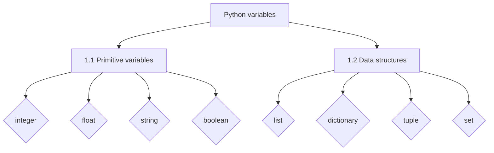

# Introduction to Python

## 1. Basic Python



### 1.1 Variable types

Variable types in Python represent simple, fundamental data types directly supported by the programming language, providing the building blocks for more complex data structures and operations.

| Variable | Declaration | Example |
| --- | --- | --- |
| Integer | *int* | `128`; `1` |
| Float | *float* | `1.5`; `14.` |
| String | *str* | `"This is a string."`; `"126"`; `",.$"` |
| Boolean | *bool* | `True`; `False` |

#### Integer

Example of Integer Variables:

- a = 1
- b = -200
- c = 30000

```py
a = 1
b = -200
c = 399999

print(a)
print(b)
print(c)
```
    <div class="output" markdown>
    1  
    -200  
    399999  
    </div>

#### Float

Example of Float Variables:

- a = 1.
- b = -3.5
- c = 548.36

```py
a = 1.
b = -3.5
c = 548.36

print(a)
print(b)
print(c)
```
    <div class="output" markdown>
    1.0  
    -3.5  
    548.36   
    </div>

#### String

Example of String Variables:

- a = "The Witcher."
- b = "12/09/2023"
- c = "56.1"

```py
a = "The Witcher."
b = "12/09/2023"
c = "56.1"
d = ""

print(a)
print(b)
print(c)
print(d)
```
<div class="output" markdown>
The Witcher.  
12/09/2023  
56.1  
    
</div>


#### Boolean

Example of Boolean Variables:

- a = True
- b = False

```py
a = True
b = False

print(a)
print(b)
```
<div class="output" markdown>
True  
False   
</div>


### 1.2 Data structures

Python data structures are essentially containers for different kinds of data.

| Variable | Declaration | Example |
| --- | --- | --- |
| List | *list* | `[1, "Hi", "23", True]` |
| Dictionary | *dict* | `{"element_a": 3, "other": False}` |
| Tuple | *tuple* | `(1, "hi", True)` |
| Set | *set* | `{"a", 4, True, 9}` |

??? example "Example of a combined data structure in real life"
    ```py
    song = {
            "title": "Bohemian Rhapsody",
            "artist": "Queen",
            "album": {
                "name": "A Night at the Opera",
                "release_year": 1975,
                "tracks": 12
            },
            "duration": "6:07",
            "genre": ["Rock", "Progressive Rock"],
            "ratings": {
                "five_stars": 3000,
                "four_stars": 2000,
                "three_stars": 500,
                "two_stars": 100,
                "one_star": 50
            },
            "is_explicit": False,
            "featured_artists": ["Freddie Mercury", "Brian May", "Roger Taylor", "John Deacon"]
    }
    ```

#### List

A **list** in Python is a collection of **ordered elements** that can contain different data types and be modified, 
allowing you to store and manage multiple values in a single variable.

??? info "More about lists"
    Lists are mutable, allowing you to modify, add, or remove elements after their creation. Lists are ordered, meaning the elements are stored in a specific sequence, and you can access elements using their index.

Example of List Variables:

- a = [1, 5.2, 3.]
- b = ["Sara", "Jorge", ""]
- c = ["Paseo de la Castellana", 136, True, "5º D"]
- z = []

```py
a = [1, 5.2, 3.]
b = ["Sara", "Jorge", ""]
c = ["Paseo de la Castellana", 136, True, "5º D"]
z = list()

print(a)
print(b)
print(c)
print(z)
```
<div class="output" markdown>
[1, 5.2, 3.0]  
['Sara', 'Jorge', '']  
['Paseo de la Castellana', 136, True, '5º D']  
[] 
</div>

#### Dictionary

A **dictionary** in Python is a collection of **key-value pairs** that allows you to store and retrieve data using unique keys, 
providing a way to organize and access data based on custom labels or identifiers.

??? info "More about dictionaries"
    Dictionaries are mutable, meaning **you can modify, add, or remove key-value pairs after their creation**. However, **dictionaries are unordered**, so the order of items may not be preserved when iterating over the dictionary.

Example of Dictionary Variables:

- a = {"a": 1, "b": 3.2, "c": }
- b = {5648: "@rachel", "test": True, "user": [2, 5, 63]}
- c = {"title": "The Matrix", "year": 1999, "genre": ["Action", "Sci-Fi], "rating": 8.7}
- z = {}

```py
a = {"a": 1, "b": 3.2, "c": False}
b = {5648: "@rachel", "test": True, "user": [2, 5, 63]}
c = {"title": "The Matrix", "year": 1999, "genre": ["Action", "Sci-Fi"], "rating": 8.7}
z = dict()

print(a)
print(b)
print(c)
print(z)
```
<div class="output" markdown>
{'a': 1, 'b': 3.2, 'c': False}  
{5648: '@rachel', 'test': True, 'user': [2, 5, 63]}  
{'title': 'The Matrix', 'year': 1999, 'genre': ['Action', 'Sci-Fi'], 'rating': 8.7}  
{}
</div>

#### Tuple

A **tuple** in Python is an **immutable ordered collection of elements** that can contain different data types, separated by commas and enclosed in parentheses, providing a way to group related data together.

??? info "Tuples Vs. Lists"
    
    Tuples are immutable, meaning **their elements cannot be changed or modified after creation**, making them suitable for situations where data should not be altered. Tuples are **faster than lists**, allowing for optimized memory allocation and faster access.

Example of Tuple Variables:

- a = (1, 2, 3)
- b = ("apple", 10, True)
- c = (3.14, "pie", [1, 2, 3], {"name": "John", "age": 30})

```python
a = (1, 2, 3)
b = ("apple", 10, True)
c = (3.14, "pie", [1, 2, 3], {"name": "John", "age": 30})
z = tuple()

print(a)
print(b)
print(c)
print(z)
```
<div class="output" markdown>
(1, 2, 3)  
('apple', 10, True)  
(3.14, 'pie', [1, 2, 3], {'name': 'John', 'age': 30})  
()
</div>

#### Set

A **set** in Python is a collection of **unique and unordered elements** that allows you to perform various set operations, such as union, intersection, and difference.

??? info "More about sets"
    Sets are defined using curly braces `{}` or the built-in `set()` function. **Duplicate elements are automatically removed**, and the order of elements is not guaranteed in a set.

Example of Set Variables:

- a = {1, 2, 3}
- b = {4, 5, 6}
- c = {True, "hello", 3.14, (1, 2)}
- z = set()

```python
a = {1, 2, 3}
b = {4, 5, 6}
c = {True, "hello", 3.14, (1, 2)}
z = set()

print(a)
print(b)
print(c)
print(z)
```
<div class="output" markdown>
{1, 2, 3}
{4, 5, 6}
{3.14, True, (1, 2), 'hello'}
set()
</div>

### 1.3 Comments

Comments in Python are lines of text that are ignored by the interpreter and are used to provide explanations, clarifications, or notes within the code.

??? tip "Tip about comments"
    In Python, it is possible to write comments using the Spanish language, including special characters. However, it is generally recommended to **avoid using accents in comments** to ensure compatibility and readability across different platforms and text editors. 

```py
# This is a comment

# Picture attributes
pic = {"picture_name": "My doggy", "date": "12/02/2023", "likes": 1658}
```

### 1.4 Declare variables

#### Naming convention

The Python naming convention for variables and files is **camel case**, where punctuation is removed, spaces are replaced by single underscores, and the letters are in lower case.

```py
# variable
this_is_a_variable = "camel case"

# examples
user_name = "Paula"
video_game = "What Remains of Edith Finch"
has_views = True
```

#### Assignment methods

Is the process of assigning or storing data to a variable, enabling the programmer to give a meaningful name to the data and easily access and manipulate it throughout the program.


- **Direct assignment:** content.
    ```py
    song = "Give it all"
    duration = 3.16
    ```
- **Multiple assignment:**
    ```py
    song, duration = "Give it all", 3.16
    ```
- **Multiple variables assignment:**
    ```py
    user = name = "Jorge"
    ```

- **User input assignment:**
    ```py
    name = input("Enter your name: ")
    age = input("Enter your age: ")
    ```


### 1.5 Print

To display output messages or values to the user on the console or terminal.

??? tip "Tip about print"
    Remember that `print()` is an essential tool for beginners and experienced developers alike, making it easier to interact with your programs and **see what's happening at each step**.

#### Basic print
```py
print(Hello, World!)
```
<div class="output" markdown>
Hello, World!
</div>

#### Variable print
```py
# Declaring variables
movie = "Barbie"
rating = 9.

# Printing variables
print(movie)
print(rating)
```
<div class="output" markdown>
Barbie  
9.0
</div>

#### In-line print
```py
# Declaring variables
movie = "Barbie"
rating = 9.

# Printing variables
print(movie, rating)
```
<div class="output" markdown>
Barbie  
9.0
</div>

#### Concat print
```py
# Declaring variables
movie = "Barbie"
rating = 9.

# Printing variables
print("The movie " + movie + " has a rating of: " + str(rating))
```
<div class="output" markdown>
The movie Barbie has a rating of: 9.0
</div>

#### Formatted string literals (f-string)
```py
# Declaring variables
movie = "Barbie"
rating = 9.

# Printing variables
print(f"The movie {movie} has a rating of {rating}")
```
<div class="output" markdown>
The movie Barbie has a rating of: 9.0
</div>


### 1.6 Type

Is used to determine the data type of a value or variable, such as whether it is an integer, string, boolean, etc.
```py
# Declaring variables
song = "Yeah Yeah Yeah"
duration = 3.25
is_suitable = True

# Get the types
song_type = type(song)
duration_type = type(duration)
is_suitable_type = type(is_suitable)

# Ouput
output = f"""Song: {song} - [{song_type}]
Duration: {duration} - [{duration_type}]
Suitable: {is_suitable} - [{is_suitable_type}]
"""

print(output)
```
    <div class="output" markdown>
    Song: Yeah Yeah Yeah - [&lt;class 'str'&gt;]  
    Duration: 3.25 - [&lt;class 'float'&gt;]  
    Suitable: True - [&lt;class 'bool'&gt;]  
    </div>


## 2 Operators

### 2.1 Numeric operators

| Operator | Statement |
| --- | --- |
| [Math operations](#basic-math-operations) | `1+3` , `5-2` , `10/5`, `2*4` |
| [Exponent](#exponent-operations) | `2**3` |
| [String -> integer/float](#string-to-integerfloat) | `int("24")` |
| [Reminder](#reminder) | `10%3` |
| [Max, min & sum](#max-min--sum-value) | `max(lst)`, `min(lst)`, `sum(lst)` |
| [Absolute](#absolute-value) | `abs(-3)` |
| [Round](#round-value) | `round(3.2153, 1)` |
| [Floor Division](#floor-division) | `12//6` |


#### Basic math operations
```py
money = 1258
employees = 3
iva = 1.21

# Add employee
employees += 1  # Is like employees = employees + 1

# Get reminder
print(money/employees)
print(money*iva)
```
<div class="output" markdown>
314.5  
1522.18
</div>


#### Exponent operations
```py
three_power_three = 3**3
three_sqrt_three = 3**.5

# Exponent operation
print(three_power_three)
print(round(three_sqrt_three, 2))
```
<div class="output" markdown>
27  
1.73
</div>

#### String to integer/float

```py
age_str = "25"

# Get integer
age_int = int(age_str)
age_float = float(age_str)

# Print types
print(type(age_str))
print(type(age_int))
print(type(age_float))
```
<div class="output" markdown>
&lt;class 'str'&gt;  
&lt;class 'int'&gt;  
&lt;class 'float'&gt;  
</div>


#### Reminder

```py
money = 1258
employees = 4

# Get reminder
print(money%employees)
```
<div class="output" markdown>
2
</div>

#### Max, min & sum value

```py
scores = [2.2, 3., 5.7, 9.1, 6., 3.2, -3.1, 9.4, -1.5, -3.6]

# Get max and min
print(max(scores))
print(min(scores))
print(sum(scores))
```
<div class="output" markdown>
9.4  
-3.6  
30.4
</div>

#### Absolute value

```py
number = -3.5

# Get max and min
print(abs(number))
```
<div class="output" markdown>
3.5
</div>

#### Round value

```py
number = 1.32586

# Round to 2 decimals
number_round = round(number, 2)
print(number_round)
```
<div class="output" markdown>
1.32
</div>

#### Floor Division

```py
one, two = 10//7, 12/8

# Output results
print(f"10/7 -> {one} ({10/7})")
print(f"12/8 -> {two} ({12/8})")
```
<div class="output" markdown>
10/7 -> 1 (1.4285714285714286)
12/8 -> 1.5 (1.5)
</div>

### 2.2 String operators

| Operator | Statement |
| --- | --- |
| [Integer/float to string](#integerfloat-to-string) | `str(31.2)` |
| [Length of a string](#length-of-a-string) | `len("Number of characters")` |
| [Concatenate strings](#concatenate-strings) | `"This" + " is" + " concatenation."` |
| [Escape characters](#escape-characters) | `"\"Hello,\" she said."` |
| [Upper, Lower, Title cases](#upper-lower-title-cases) | `"My NaMe iS aLiCIa".lower()` |
| [String to list](#string-to-list) | `"Welcome to the dark side".split()` |
| [Split string by](#list-to-string) | `"This;is;a;string".split(";")` |
| [List to string](#list-to-string) | `" ".join(["Hello", "World"])` |
| [New line and tabulator](#new-line-and-tabulator) | `"First line\n Second line"` |
| [Check substring](#check-substring) | `"a" in "This is a test"` |
| [Check only letters](#check-only-letters) | `"abcdefghijklmn".isalpha()` |
| [Multiply strings](#multiply-strings) | `"Three"*3` |
| [Replace string](#replace-string) | `"Thiz iz a ztring".replace("z", "s")` |
| [Strip text](#strip-text) | `"   Hi   ".strip()` |
| [Find index](#find-index) | `"This is a string".find("s")` |


#### Integer/float to string

```py
time_int = 31
time_float = 31.25

# Get integer
time_int_str = str(time_int)
time_float_str = str(time_float)

# Print types
print(time_int_str, type(time_int_str))
print(time_float_str, type(time_float_str))
```
<div class="output" markdown>
31 &lt;class 'str'&gt;  
31.25 &lt;class 'str'&gt;  
</div>

#### Length of a string

```py
song = "Back in Black"
password = "4r236TY5S5F65H6xjt"

# Get lenghts
print(len(song))
print(len(password))
```
<div class="output" markdown>
13  
18
</div>

#### Concatenate strings

```py
song = "doomsday"
artist = "sad face."

# Concatenate string
message = "The song " + song + " is made by " + artist
print(message)
```
<div class="output" markdown>
The song doomsday is made by sad face.
</div>

#### Escape characters

```py
# Escape symbols
message = "Somtimes he goes by \"chuck\""
print(message)
```
<div class="output" markdown>
Somtimes he goes by "chuck"
</div>

#### Upper, Lower, Title cases

```py
message = "Hello, world"

# Upper, Lower, Title cases
message_low = message.lower()
message_up = message.upper()
message_title = message.title()

# Print messages
print(f"Low -> {message_low}")
print(f"Up -> {message_up}")
print(f"Title -> {message_title}")
```
<div class="output" markdown>
Low -> hello, world  
Up -> HELLO, WORLD  
Title -> Hello, World
</div>

#### String to list

```py
message = "This is a String"
print(message.split())
```
<div class="output" markdown>
['This', 'is', 'a', 'String']
</div>

#### Split string by

```py
message = "This-is-a-long-string"
print(message.split('-'))
```
<div class="output" markdown>
['This', 'is', 'a', 'long', 'string']
</div>

#### List to string
```py
message = ['This', 'is', 'a', 'long', 'string']
print(" ".join(message))
```
<div class="output" markdown>
This is a long string
</div>

#### New line and tabulator

```py
new_line = "First line\nNew line"
tabulator = "\tTabulator line"

# Print
print(new_line)
print(tabulator)
```
<div class="output" markdown>
First line  
New line  
&ensp;Tabulator line
</div>

#### Check substring

```py
code = "The code is: 5223565-K"

# Check K is in code
check = "K" in code
print(check)
```
<div class="output" markdown>
True
</div>

#### Check only letters

```py
is_alpha = "AlphaCode"

# Check alphanumeric
check = is_alpha.isalpha()
print(check)
```
<div class="output" markdown>
True
</div>

#### Multiply strings

```py
pattern = "-"

# Print
multi = pattern * 5
print(multi)
```
<div class="output" markdown>
\-----
</div>

#### Replace string

```py
message = "Thiz iz a ztring"

# Replace string
message = message.replace("z", "s")
print(message)
```
<div class="output" markdown>
This is a string
</div>

#### Strip text

```py
message = "    Strip message    "

# Strip message
message_strip = message.strip()

# Comparison
print(f"{message} ({len(message)})")
print(f"{message_strip} ({len(message_strip)})")
```
<div class="output" markdown>
&nbsp;&nbsp;&nbsp;&nbsp;Strip message&nbsp;&nbsp;&nbsp;&nbsp;(21)  
Strip message (13)
</div>

#### Find index

```py
message = "This is a string"
letter = "s"

# Find first letter index
idx = message.find(letter)
print(f"{message} (First \"{letter}\" is in position: {idx})")
```
<div class="output" markdown>
This is a string (First "s" is in position: 3)
</div>

### 2.3 List operators

| Operator | Statement |
| --- | --- |
| Element at index | `lst[2]` |
| Get last element | `lst[-1]` |
| Modify item | `lst[1] = 'x'` |
| Add item at the end | `lst.append('a')` |
| Slicing a list | `lst[1:3]` |
| Order a list | `sorted(lst)` |
| List length | `len(lst)` |
| List from range | `list(range(1, 5))` |
| Reverse a list | `lst.reverse()` |
| Remove item | `lst.remove(5)` |
| Count item | `lst.count('#')` |
| Entwine lists | `zip(lst_a, lst_b)` |
| Enumerate list | `enumerate(lst)` |


#### Element at index

!!! warning "Indexing in python"
    Remember that indexing in Python starts from 0, so **the first element is at index 0**, the second at index 1, and so on.

```py
# List of planets
planets = ["Mercury", "Venus", "Earth", "Mars", "Jupiter", "Saturn", "Uranus", "Neptune"]

# Extracting value at index 2 (which is the third element in the list)
value = planets[2]

print(value)
```
<div class="output" markdown>
Earth
</div>

#### Get last element

To get the last element from a list in Python, you can use negative indexing. Negative indices count elements from the end of the list, where -1 represents the last element, -2 represents the second-to-last element, and so on.

```py
planets = ["Mercury", "Venus", "Earth", "Mars", "Jupiter", "Saturn", "Uranus", "Neptune"]

# Getting the last element using the negative index
last_planet = planets[-1]
penultimate_planet = planets[-2]

print(last_planet)
print(penultimate_planet)
```
<div class="output" markdown>
Neptune
Uranus
</div>

#### Modify item

Suppose we want to modify the name of a planet, let's say "Mars" to "Red Planet." We can do this by using the index to access the element and then assigning the new name to it.

```py
# Original list of planets
planets = ["Mercury", "Venus", "Earth", "Mars", "Jupiter", "Saturn", "Uranus", "Neptune"]

# Modifying the name of a planet
index_of_mars = 3  # Index of "Mars" is 3
new_name = "Red Planet"
planets[index_of_mars] = new_name

# Updated list of planets
print(planets)
```
<div class="output" markdown>
["Mercury", "Venus", "Earth", "Red Planet", "Jupiter", "Saturn", "Uranus", "Neptune"]
</div>

#### Add item at the end

If we want to add the planet "Pluto" at the end of the list, we can use the append() method.

```py
# Original list of planets
planets = ["Mercury", "Venus", "Earth", "Mars", "Jupiter", "Saturn", "Uranus", "Neptune"]

# Adding "Pluto" at the end of the list using append()
planets.append("Pluto")

# Updated list of planets
print(planets)
```
<div class="output" markdown>
["Mercury", "Venus", "Earth", "Mars", "Jupiter", "Saturn", "Uranus", "Neptune", "Pluto"]
</div>

#### Slicing a list

Imagine we want to create a new list containing the planets before "Earth," including "Earth," by using slicing.

??? info "More about slicing lists"
    When using slicing in Python lists, the slice includes all elements up to, but not including, the index specified as the end of the slice.

```py
# Original list of planets
planets = ["Mercury", "Venus", "Earth", "Mars", "Jupiter", "Saturn", "Uranus", "Neptune"]

# Slicing to include planets before and including "Earth"
sliced_planets = planets[:2 + 1]

# Sliced list of planets
print(sliced_planets)
```
<div class="output" markdown>
["Mercury", "Venus", "Earth"]
</div>

??? tip "Advanced code"
    If we don't want to insert the index of the planet Earth manually we can use the index method.
    ```py
    sliced_planets = planets[:planets.index("Earth") + 1]
    ```

#### Order a list

In this example, the `sorted()` function is used to sort the list of planets alphabetically, and the sorted result is stored in the sorted_planets variable.

```py
# List of planets
planets = ["Mercury", "Venus", "Mars", "Earth", "Jupiter", "Saturn", "Uranus", "Neptune"]

# Sort the planets alphabetically
sorted_planets = sorted(planets)

# Print the sorted list of planets
print(sorted_planets)
```
<div class="output" markdown>
['Earth', 'Jupiter', 'Mars', 'Mercury', 'Neptune', 'Saturn', 'Uranus', 'Venus']
</div>

#### List length

In this example, the `len()` function is used to count the number of items in a list.

```py
# List of planets
planets = ["Mercury", "Venus", "Mars", "Earth", "Jupiter", "Saturn", "Uranus", "Neptune"]

# Sort the planets alphabetically
n_planets = len(planets)

# Print the sorted list of planets
print(f"There are {n_planets} planets in the solar system.")
```
<div class="output" markdown>
There are 9 planets in the solar system.
</div>

#### List from range

```py
# Using range(2, 3) to create a list with a single element
list1 = list(range(2, 4))

# Using range(6) to create a list with numbers from 0 to 5
list2 = list(range(6))

# Print the lists
print(list1)
print(list2)
```
<div class="output" markdown>
[2, 3]  
[0, 1, 2, 3, 4, 5]
</div>

#### Reverse a list

There are two methods to reverse a list, using the `lst.reverse()` function and slicing `lst[::-1]`.

!!! warning "`Reverse()` Vs. `[::-1]`"
    The reverse() method modifies the original list in place, while slicing [::-1] creates a new reversed list without modifying the original one.


```py
# List of planets in the solar system
planets = ["Mercury", "Venus", "Earth", "Mars", "Jupiter", "Saturn", "Uranus", "Neptune"]

# Method 1: Using reverse()
reversed_planets_1 = planets.copy()
reversed_planets_1.reverse()

# Method 2: Using slicing [::-1]
reversed_planets_2 = planets[::-1]

# Print the reversed lists
print("Reversed using reverse():", reversed_planets_1)
print("Reversed using slicing [::-1]:", reversed_planets_2)
```
<div class="output" markdown>
Reversed using reverse(): ['Neptune', 'Uranus', 'Saturn', 'Jupiter', 'Mars', 'Earth', 'Venus', 'Mercury']  
Reversed using slicing [::-1]: ['Neptune', 'Uranus', 'Saturn', 'Jupiter', 'Mars', 'Earth', 'Venus', 'Mercury']
</div>

#### Remove item

The `remove()` method is used to remove the specified element ("Pluto" in this case) from the list planets. After calling `remove("Pluto")`, "Pluto" is no longer present in the list.

```py
# List of planets in the solar system
planets = ["Mercury", "Venus", "Earth", "Mars", "Jupiter", "Saturn", "Uranus", "Neptune", "Pluto"]

# Remove "Pluto" from the list
planets.remove("Pluto")

# Print the updated list of planets
print(planets)
```
<div class="output" markdown>
['Mercury', 'Venus', 'Earth', 'Mars', 'Jupiter', 'Saturn', 'Uranus', 'Neptune']
</div>

#### Count item

In this example, the `count()` function is used to count the occurrences of the element "Earth" in the planets list. The count is then stored in the variable earth_count and printed to the console. As you can see, "Earth" appears twice in the list, so the count is 2.

```py
# List of planets in the solar system
planets = ["Mercury", "Venus", "Earth", "Mars", "Jupiter", "Saturn", "Uranus", "Neptune", "Pluto", "Earth"]

# Count the number of occurrences of "Earth" in the list
earth_count = planets.count("Earth")

# Print the count
print("The number of times 'Earth' appears in the list:", earth_count)
```
<div class="output" markdown>
The number of times 'Earth' appears in the list: 2
</div>

#### Entwine lists

In this example, the `zip()` function is used to combine the planets list and the distances list into a new list called planet_distances. Each tuple in the planet_distances list contains a planet name and its corresponding distance from the Sun. The list() function is used to convert the zip object into a list for easy printing.

```py
# Lists of planets and their distances from the Sun (in millions of kilometers)
planets = ["Mercury", "Venus", "Earth", "Mars", "Jupiter"]
distances = [57.9, 108.2, 149.6, 227.9, 778.3]

# Use zip to combine the two lists into a list of tuples
planet_distances = list(zip(planets, distances))

# Print the combined list
print(planet_distances)
```
<div class="output" markdown>
[('Mercury', 57.9), ('Venus', 108.2), ('Earth', 149.6), ('Mars', 227.9), ('Jupiter', 778.3)]
</div>

#### Enumerate list

In this example, `enumerate(planets)` returns an iterator that produces tuples containing the index and planet from the planets list. 

```py
# List of planets
planets = ["Mercury", "Venus", "Earth", "Mars", "Jupiter"]

# Get an iterator for the planets list along with their indices using enumerate()
enum_planets = enumerate(planets)
print(list(enum_planets))
```
<div class="output" markdown>
[(0, 'Mercury'), (1, 'Venus'), (2, 'Earth'), (3, 'Mars'), (4, 'Jupiter')]
</div>

### 2.4 Dictionary operators

| Operator | Statement |
| --- | --- |
| Add key | `dct['new_key'] = True` |
| Add multiple keys | `dct.update({'key1' = 1, 'key2' = False})` |
| Overwrite value | `dct['key'] = False` |
| Extract value | `dct['new_key']` |
| Delete key and value | `del dct['key_to_delete']` |
| Keys & values list | `dct.keys()`, `dct.values()`, `dct.items()` |
| Check key | `"key" in market_value` |
| Pair lists to dict | `dict(zip(dct_1, dct_2))` |

#### Add key

```py
# Dictionary representing market value of stock tech companies
market_value = {
    "Apple": 2345.67,
    "Microsoft": 1765.89,
    "Amazon": 3012.45,
    "Google": 2789.34,
    "Facebook": 1890.56
}

# Add key: Add a new company and its market value
market_value["Tesla"] = 1899.32
print(market_value)
```
<div class="output" markdown>
{'Apple': 2345.67, 'Microsoft': 1765.89, 'Amazon': 3012.45, 'Google': 2789.34, 'Facebook': 1890.56, 'Tesla': 1899.32}
</div>

#### Add multiple keys

```py
# Dictionary representing market value of stock tech companies
market_value = {
    "Apple": 2345.67,
    "Microsoft": 1765.89,
    "Amazon": 3012.45,
    "Google": 2789.34,
    "Facebook": 1890.56
}

# Add multiple keys: Add multiple new companies and their market values
market_value.update({"Netflix": 2156.78, "Adobe": 1654.32})
print(market_value)
```
<div class="output" markdown>
{'Apple': 2345.67, 'Microsoft': 1765.89, 'Amazon': 3012.45, 'Google': 2789.34, 'Facebook': 1890.56, 'Netflix': 2156.78, 'Adobe': 1654.32}
</div>

#### Overwrite value

```py
# Dictionary representing market value of stock tech companies
market_value = {
    "Apple": 2345.67,
    "Microsoft": 1765.89,
    "Amazon": 3012.45,
    "Google": 2789.34,
    "Facebook": 1890.56
}
print(f"Before: {market_value}")

# Overwrite value: Update the market value of a company
market_value["Apple"] = 2367.98
print(f"After: {market_value}")
```
<div class="output" markdown>
Before: {'Apple': 2345.67, 'Microsoft': 1765.89, 'Amazon': 3012.45, 'Google': 2789.34, 'Facebook': 1890.56}
After: {'Apple': 2367.98, 'Microsoft': 1765.89, 'Amazon': 3012.45, 'Google': 2789.34, 'Facebook': 1890.56}
</div>

#### Extract value

```py
market_value = {
    "Apple": 2345.67,
    "Microsoft": 1765.89,
    "Amazon": 3012.45,
    "Google": 2789.34,
    "Facebook": 1890.56
}

# Extract value: Get the market value of a specific company
google_value = market_value["Google"]
print("Market value of Google:", google_value)
```
<div class="output" markdown>
Market value of Google: 2789.34
</div>

#### Delete key and value

```py
market_value = {
    "Apple": 2345.67,
    "Microsoft": 1765.89,
    "Amazon": 3012.45,
    "Google": 2789.34,
    "Facebook": 1890.56
}

# Delete key and value: Remove a company and its market value from the dictionary
del market_value["Facebook"]
```
<div class="output" markdown>
{'Apple': 2345.67, 'Microsoft': 1765.89, 'Amazon': 3012.45, 'Google': 2789.34}
</div>

#### Extract keys & values

```py
# Dictionary representing market value of stock tech companies
market_value = {
    "Apple": 2345.67,
    "Microsoft": 1765.89,
    "Amazon": 3012.45,
    "Google": 2789.34,
    "Tesla": 1899.32,
    "Netflix": 2156.78,
    "Adobe": 1654.32
}

# Using .keys() to get a view of keys
keys_view = market_value.keys()

# Using .values() to get a view of values
values_view = market_value.values()

# Using .items() to get a view of (key, value) pairs
items_view = market_value.items()

# Print the views
print("Keys view:", keys_view)
print("Values view:", values_view)
print("Items view:", items_view)
```
<div class="output" markdown>
Keys view: dict_keys(['Apple', 'Microsoft', 'Amazon', 'Google', 'Tesla', 'Netflix', 'Adobe'])  
Values view: dict_values([2345.67, 1765.89, 3012.45, 2789.34, 1899.32, 2156.78, 1654.32])  
Items view: dict_items([('Apple', 2345.67), ('Microsoft', 1765.89), ('Amazon', 3012.45), ('Google', 2789.34), ('Tesla', 1899.32), ('Netflix', 2156.78), ('Adobe', 1654.32)])
</div>

#### Check key

```py
market_value = {
    "Apple": 2345.67,
    "Microsoft": 1765.89,
    "Amazon": 3012.45,
    "Google": 2789.34,
    "Facebook": 1890.56
}

# Check key: Check if a company is in the dictionary
if "Microsoft" in market_value:
    print("Microsoft is in the dictionary.")
else:
    print("Microsoft is not in the dictionary.")
```
<div class="output" markdown>
Microsoft is in the dictionary.
</div>

#### Pair lists to dict

```py
# Lists of tech companies and their market values
tech_companies = ["Apple", "Microsoft", "Amazon", "Google", "Tesla"]
market_values = [2345.67, 1765.89, 3012.45, 2789.34, 1899.32]

# Create a dictionary by pairing tech_companies with market_values
market_value_dict = dict(zip(tech_companies, market_values))

# Print the resulting dictionary
print(market_value_dict)
```
<div class="output" markdown>
{'Apple': 2345.67, 'Microsoft': 1765.89, 'Amazon': 3012.45, 'Google': 2789.34, 'Tesla': 1899.32}
</div>


## 3. If, elif, else statements

The if statement in Python is used to make decisions in code by checking whether a condition is true or false, and executing specific blocks of code based on the evaluation of the condition.

??? tip "Indentation tip"
    **Indentation in an if statement is crucial in Python** because it defines the block of code that should be executed **if the condition is true**. 

| Operator | Condition |
| --- | --- |
| True | always runs |
| False | never runs |
| a > b | a greater than b |
| a >= b | a greater or equal to b |
| a < b | a smaller than b |
| a <= b | a smaller or equal to b |
| a == b | a equal to b |
| a != b | a not equal to b |
| a in b | string in b |
| not(a in b) | string not in b |


### 3.1 if else

```py
score = 75

if score >= 60:
    print("Congratulations! You have passed the exam.")
else:
    print("Unfortunately, you did not pass the exam. Better luck next time.")

```
<div class="output" markdown>
Congratulations! You have passed the exam.
</div>

### 3.2 if, elif, else
```py
number = 0

# Check the number and provide a corresponding message
if number > 0:
    print("The number is positive.")
elif number < 0:
    print("The number is negative.")
else:
    print("The number is zero.")
```
<div class="output" markdown>
The number is zero.
</div>

### 3.3 Nested if, else

Let's consider a scenario where we have a user registration process, and we want to check the age of the user and whether they have provided all the required information.

1. Check if the user's age is 18 or above using the outer if statement
2. check if the user has provided both their name and email

```py
age = 25
has_name = True
has_email = False

if age >= 18:
    if has_name and has_email:
        print("User registration successful!")
    else:
        print("Please provide both your name and email to complete the registration.")
else:
    print("Sorry, you must be at least 18 years old to register.")
```
<div class="output" markdown>
Please provide both your name and email to complete the registration.
</div>


## 4. Loops

### 4.1 For loop

A for loop in Python is a way to repeat a set of instructions for each item in a collection (like a list or a string), allowing you to perform the same task on multiple elements one by one.

#### Iterating a list

```py
# List of planet names
planet_names = ['Mercury', 'Venus', 'Earth', 'Mars', 'Jupiter', 'Saturn', 'Uranus', 'Neptune']

# Iterating over the list and printing each planet name in capital letters
print("NASA's Planets:")
for planet in planet_names:
    planet_capital = planet.upper()
    print(planet, planet_capital)
```
<div class="output" markdown>
NASA's Planets:  
Mercury MERCURY  
Venus VENUS  
Earth EARTH  
Mars MARS  
Jupiter JUPITER  
Saturn SATURN  
Uranus URANUS  
Neptune NEPTUNE  
</div>

#### Iterating a string

```py
# Tweet text
tweet = "Having a great time at the beach with friends. #summerfun #beachlife"

# Iterate over each letter an count the number of hashtags
n_hashtags = 0
for letter in tweet:
    if "#" == letter:
        n_hashtags += 1

print(f"Number of Hashtags found: {n_hashtags}")
```
<div class="output" markdown>
Number of Hashtags found: 2 
</div>

#### Iterating a range

```py
# DNA sequence as a list of nucleotides
dna_sequence = ['A', 'T', 'G', 'C', 'A']

# Iterate over each position in the DNA sequence using range(10)
for i in range(len(dna_sequence)):
    nucleotide = dna_sequence[i]
    position = i + 1
    print(f"Position {position}: {nucleotide}")
```
<div class="output" markdown>
Position 1: A  
Position 2: T  
Position 3: G  
Position 4: C  
Position 5: A  
</div>

#### Enumerating list

This example is the same from the previous one but using enumerate. Enumerate helps you iterate over a sequence (like a list, tuple, or string) while also keeping track of the index of each element in the sequence.

??? info "Enumerate Vs. range"
    The advantage of using enumerate instead of range in the previous code is that enumerate provides a more concise and expressive way to access both the elements and their corresponding indices in a sequence. It simplifies the code and makes it more readable.

```py
# DNA sequence as a list of nucleotides
dna_sequence = ['A', 'T', 'G', 'C', 'A']

# Iterate over each position in the DNA sequence using range(10)
for i, nucleotide in enumerate(dna_sequence):
    position = i + 1
    print(f"Position {position}: {nucleotide}")
```
<div class="output" markdown>
Position 1: A  
Position 2: T  
Position 3: G  
Position 4: C  
Position 5: A  
</div>

??? tip "Advanced for loop"
    **List comprehension** is a concise way to create a new list in Python by performing some operation on each item of an existing list or iterable. It allows you to **combine a for loop and an expression in a single line** to generate a new list efficiently.
    ```py
    planets = ["Mercury", "Venus", "Earth", "Mars", "Jupiter", "Saturn", "Uranus", "Neptune"]

    # Example 1: Create a new list with the lengths of each planet name
    planet_name_lengths = [len(planet) for planet in planets]

    # Example 2: Create a new list with uppercase planet names
    uppercase_planets = [planet.upper() for planet in planets]

    print(planet_name_lengths)
    print(uppercase_planets)
    ```
    <div class="output" markdown>
    [7, 5, 5, 4, 7, 6, 6, 7]  
    ['MERCURY', 'VENUS', 'EARTH', 'MARS', 'JUPITER', 'SATURN', 'URANUS', 'NEPTUNE']

    </div>


### 4.2 While loop

A while loop in Python is a way to repeatedly execute a block of code as long as a certain condition is true. It keeps running the instructions until the condition becomes false, allowing you to perform tasks until a specific condition is met. 

??? info "While Vs. for loops"
    A while loop should be used in Python when the number of iterations is not known beforehand, and the loop needs to continue as long as a certain condition remains true. It is ideal for scenarios where the loop's termination depends on real-time or user input conditions.

```py
clothes = ["T-shirts", "Jeans", "Dresses", "Jackets", "Shoes", "Hats"]

# Using a while loop to print the available clothes
choice = "yes"
counter = 0

# Welcome print message
print("Welcome to the Fashion Clothes Store!")

while choice == "yes" and counter < len(clothes):
    print(clothes[index])
    counter += 1
    choice = input("Do you want to see more clothes? (yes/no): ")
    choice = choice.lower()

print("Thank you for visiting our Fashion Clothes Store!")
```
<div class="output" markdown>
Welcome to the Fashion Clothes Store!
T-shirts
Do you want to see more clothes? (yes/no): Yes
T-shirts
Do you want to see more clothes? (yes/no): No
Thank you for visiting our Fashion Clothes Store! 
</div>


## :material-file-code: **-> Start coding**

You can do the exercises in Google Colab or in Jupyter Lab

**Google Colab**

Open the [11_introduction_to_python.ipynb](https://colab.research.google.com/github/charlstown/ai-applied-practice/blob/main/unit-1/11_introduction_to_python.ipynb) notebook to start doing the exercises.

!!! tip "reminder"
    Remember to [fork the exercise repository](https://github.com/charlstown/ai-applied-practice/fork) and save your solved notebooks in your forked repo.

**Jupyter Lab**

WIP